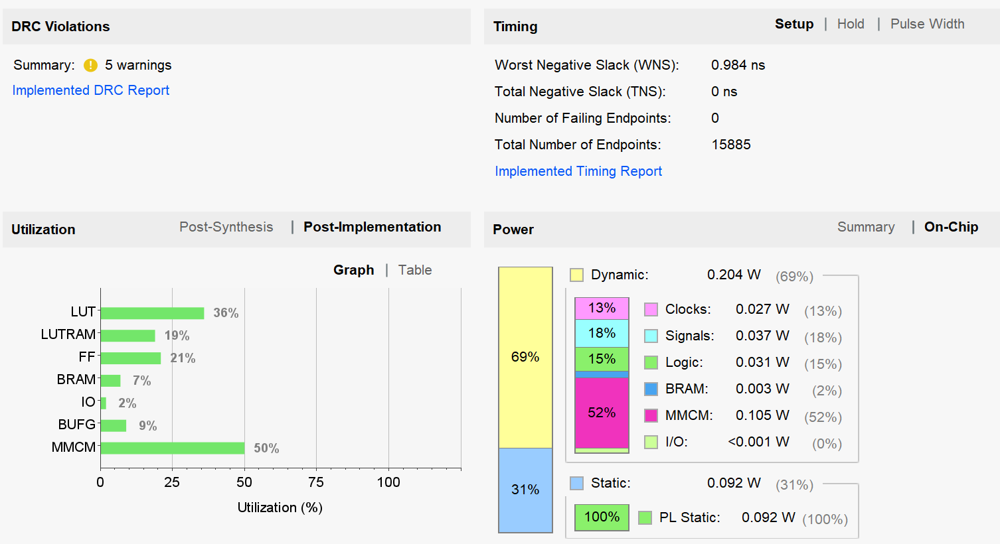

# 设计文档

RTL文件：

| 文件名      | 详情                                 | 调用者   |
| ----------- | ------------------------------------ | -------- |
| aes_core.v  | AES加密顶层文件                      |          |
| aes_keys.v  | 用来生成AES轮密钥，共11轮            | aes_core |
| aes_add.v   | 轮密钥加，将数据与轮密钥异或         | aes_core |
| aes_sbox.v  | S盒，用于字节代换（包括G函数的代换） | aes_core |
| aes_shift.v | 行位移                               | aes_core |
| aes_mix.v   | 列混淆                               | aes_core |

测试文件：

| 文件名   | 详情                                          |
| -------- | --------------------------------------------- |
| tb_aes.v | 通过mem文件输入明文和密钥，输出加密结果和波形 |

## AES

AES主要有四种操作，轮密钥加（aes_add）,字节代换（aes_sbox），行位移（aes_shift），列混淆（aes_mix）

共进行11轮循环，所以aes_core被设计为11个周期后出结果

### aes_core

| 信号      | 方向     | 描述                          |
| --------- | -------- | ----------------------------- |
| sclk      | input    | 系统时钟                      |
| srst_n    | input    | 重置信号，拉低有效            |
| en        | input    | 起始信号，拉高后开始加密      |
| text      | input    | 明文，en拉高有效              |
| key       | input    | 密钥，en拉高有效              |
| round     | internal | 表示当前为第几轮              |
| round_key | internal | 轮密钥                        |
| state     | internal | 加密过程的中间数据，s10为结果 |
| valid     | output   | 拉高表示结果有效              |
| val       | output   | 加密结果                      |

### aes_keys

| 信号        | 方向     | 描述                           |
| ----------- | -------- | ------------------------------ |
| sclk        | input    | 系统时钟                       |
| srst_n      | input    | 重置信号，拉低有效             |
| en          | input    | 起始信号，拉高后开始产生轮密钥 |
| key         | input    | 初始密钥                       |
| round       | internal | 表示当前为第几轮               |
| w0,w1,w2,w3 | internal | 扩展密钥数组                   |
| round_key   | output   | 轮密钥输出                     |

## TOP

| 信号   | 方向   | 描述                                                               |
| ------ | ------ | ------------------------------------------------------------------ |
| sclk   | input  | 系统时钟                                                           |
| tvalid | input  | AXI-stream valid信号                                               |
| tlast  | input  | AXI-stream last信号                                                |
| tready | output | AXI-stream ready信号                                               |
| tid    | input  | AXI-stream id                                                      |
| tdata  | input  | AXI-stream 数据输入，需要两拍，第一拍传明文，第二拍传密钥（128位） |
| ovalid | output | 输出数据有效信号                                                   |
| oid    | output | 输出数据对应id                                                     |
| odata  | output | 输出数据                                                           |

# 上板

- 软件：Vivado 2022.2
- FPGA：ZYNQ 7010
- 顶层文件：**top.sv**
- 调用IP：clock，ila
- 时钟频率：100MHz（板载50MHz，使用MMCM倍频，如果不使用ila可以更高）

